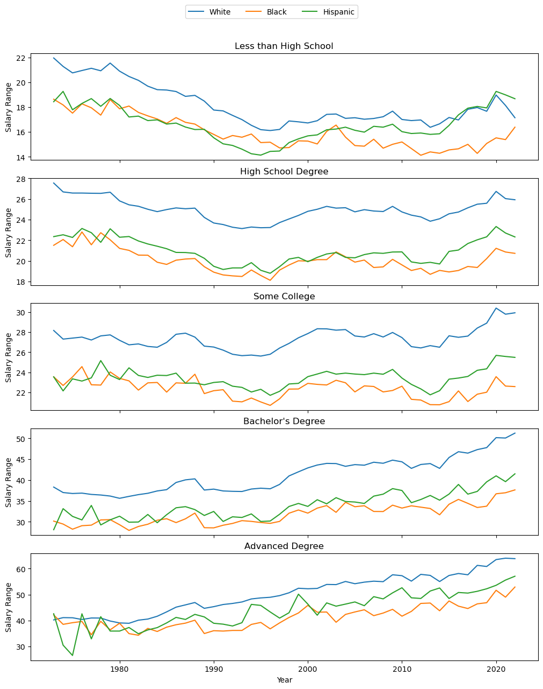

  

Gender pay gap is a ubiquitously known problem of the modern world. Reports indicate that "... in 2024, women earned an average of 85% of what men earned...([REF](https://www.pewresearch.org/short-reads/2025/03/04/gender-pay-gap-in-us-has-narrowed-slightly-over-2-decades/))". Although the gap has been decreasing steadily, the changes have been slow, with "... businesses having a long way to go to reach gender equality...([REF](https://www.skillcast.com/blog/gender-equality-gender-pay-gap-reporting))".

In this project and report, I take a closer look at this phenomenon in an attempt to quantify the gap and raise clarity and awareness among women. I hope this empowers women to speak up for themselves and demand equal treatment as their male counterparts.

# 1. Data

The data I picked to explore comes from [Wages By Education](https://www.kaggle.com/datasets/asaniczka/wages-by-education-in-the-usa-1973-2022) from Kaggle, encompassing the hourly salary data for various demographic groups and educational backgrounds between the years of 1973 and 2022.

# 2. Data Wrangling and EDA

Given the source of the data, it is pretty clean with no `null` values or mismatched datatypes, etc. Therefore, it required minimal wrangling ([Wrangling Notebook](https://github.com/nazilagundogdu/GenderPayGap/blob/main/1.%20DataWrangling.ipynb)). However, some adjustments, such as reshaping the data, were necessary for the EDA ([EDA Notebook](https://github.com/nazilagundogdu/GenderPayGap/blob/main/2.%20EDA.ipynb)).

The following boxplots show the average pay disparity between the male and female workforce (on the left), and broken down by education level (on the right). One can see that women are underpaid at every educational level.

  
  

The issue is exacerbated when we consider race as a factor too, with white people being paid more than their Black or Hispanic counterparts, overall. We can see the pay trends for the 49 years of data, which show the gap for different educational levels between racial demographics. Note that this data is for men only. But, we see the same trend, albeit less drastic, for women of different races.

  

# 3. Preprocessing and Modeling

The data has a mixture of categorical and numerical values. To handle the categorical data, I used one-hot encoding (`get_dummies()` from Pandas). I also reshaped the data from a wide format to a long format. I compared three modeling algorithms (two with tuning as well — so five in total) for this dataset, whose results you see below:

| Model                | RMSE      | R-squared |
|:---------------------|:----------|:----------|
| Tuned Random Forest  | 3.108835  | 0.909929  |
| Tuned Decision Trees | 3.217546  | 0.903520  |
| Linear Regression    | 3.526582  | 0.884097  |
| Random Forests       | 3.740412  | 0.869615  |
| Decision Trees       | 4.031768  | 0.848512  |

  
    <strong>Best model: Tuned Random Forests</strong>
  

To visualize the model performance better, the following plot shows the correlation between actual values and the predicted ones.

  

# 4. Predictions

I used the tuned Random Forest model to make predictions for the year 2050 for the following groups:

| Gender  | Race   | Education Level   | Current Average Salary | Predicted Salary |
|:--------|:-------|:------------------|:------------------------|:-----------------|
| Male    | White  | Bachelor's Degree | $41.23                  | $44.45           |
| Female  | White  | Bachelor's Degree | $29.18                  | $43.98           |
| Male    | White  | Advanced Degree   | $50.17                  | $56.10           |
| Female  | White  | Advanced Degree   | $36.98                  | $54.27           |

A plot can help visualize this better, showing that the gap is predicted to narrow in the years to come.

  

# 5. What's Next?

There are various aspects of this project that can be further developed:

- Work on non-cleaned, real-world data from sources other than Kaggle
- Compare gender pay gaps across different countries of similar wealth/status
- Reframe the analysis as a classification or clustering problem, such as:
  “Which demographic group does person X belong to if their salary is Y and their education level is Z?”
- Improve hyperparameter tuning by using GridSearchCV with more exhaustive parameters (instead of the RandomizedSearchCV with 20 iterations used here due to computational constraints)

It is a sad story that in the year 2025 (the time of this project), women are still fighting for equal rights. We have come a long way, but there is still a lot to do. I hope this is remedied in my lifetime!

  

