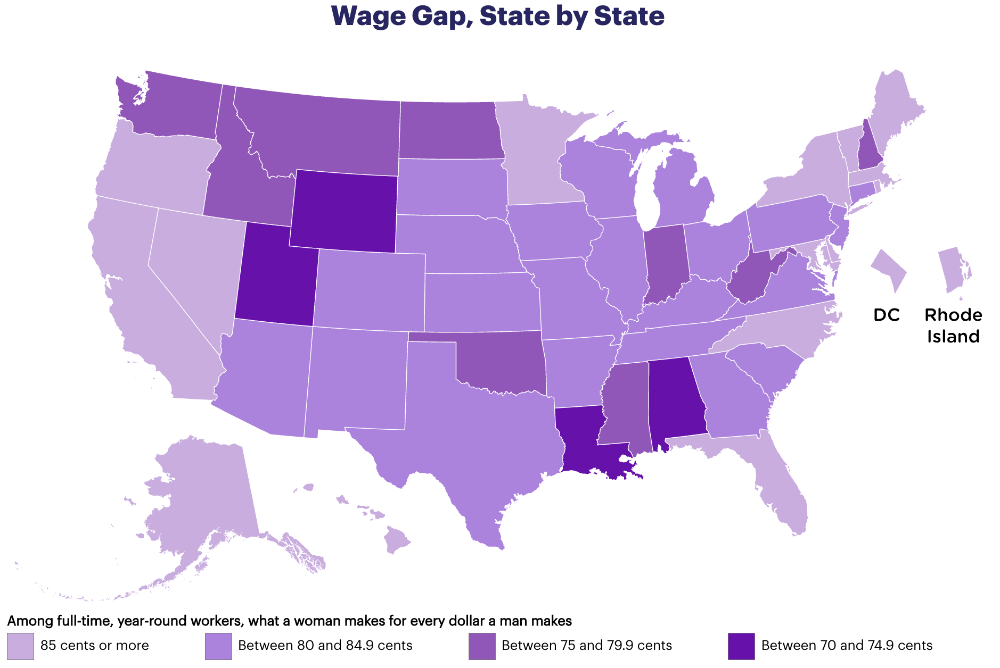

# Mapping the Gender Pay Gap: Insights for Equity and Action

---

## Context & Motivation  
The gender-based pay gap remains a persistent and well-documented issue in the U.S. Despite equal qualifications, experience, and education, women are consistently paid less than their male counterparts. According to the National Women’s Law Center (see figure below), the gap can be as wide as **74.9 cents per dollar earned by men**, in some states.

  

I firmly believe that every woman deserves to be paid her worth. Achieving that requires both awareness and access to tools—from salary negotiation strategies to career services. At the same time, systemic change is essential, such as advocating for **federal policies like mandatory pay transparency** in job postings.

---

## Project Objective  
This project aims to analyze gender pay disparities based on **education level, gender, and race**, and develop a model that can **predict these disparities with >90% accuracy** over a period of **3 months**.

---

## Criteria for Success  
- Complete analysis of gender pay gaps including:
  - Data wrangling  
  - Exploratory Data Analysis (EDA)  
  - Machine learning modeling  
- Achieving at least **90% accuracy** in predicting pay gaps  
- Publishing a **summary report or dashboard** with key findings on platforms such as **GitHub** and **LinkedIn**

---

## Potential Clients/Audience  
This project can benefit:
- Women across various industries and educational/experience levels  
- Career services organizations and coaching platforms  
- Advocacy groups pushing for labor equity  
- Awareness campaigns and workshops aimed at educating the general public on financial and systemic inequalities

---

## Scope of Solution Space  
Focus will be on **3 to 5 industries**, such as:
- Tech  
- Healthcare  
- Law  
- Sales  
- (etc.)

---

## Constraints  
A major challenge is the **availability of data**, particularly from private sectors where salary information isn’t public. Much of the analysis may rely on **self-reported salaries**, which can introduce **bias and data gaps**.

---

## Data Sources  
- **Primary**: Kaggle’s *Wages by Education in the USA (1973–2022)*  
- **Supplementary**:  
  - Neilsberg  
  - CCRPC  
  - NWLC

---

## References  
National Women’s Law Center. ["Wage Gap by State."](https://nwlc.org/resource/wage-gap-state-by-state/) *National Women's Law Center*, February 2025.
